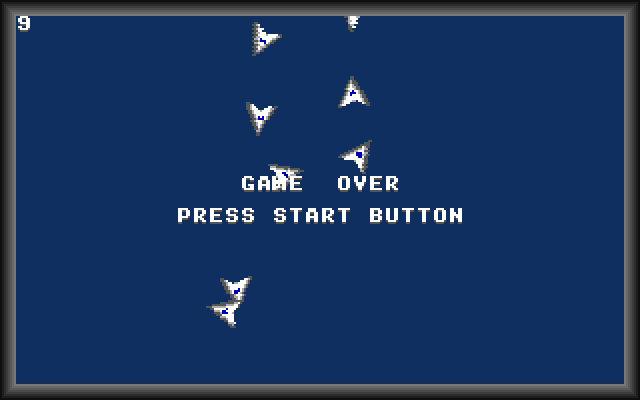

# Infinite Generations



## ゲーム概要

1. 一定時間が経過すると子が生まれます
2. 一定時間経過すると孫が生まれます
3. 一定時間経過するとひ孫が生まれます
4. 一定時間経過すると玄孫が生まれます
5. 以下、その繰り返しです

スネークゲームのようなものです。
子は自分の親をホーミングのアルゴリズムで追いかけます。
壁にぶつかるか子孫にぶつかるとゲームオーバーです。
なお、生まれたての子は出産をするまでの間は当たり判定がありません。
さぁ、あなたは何世代の成長を見守れるかな？

## 遊び方

- 左右キーで回転
- Zキーで加速
- Xキーで原則
- Cキーでスクショ（.bmp形式）保存
- Rキーでリセット
- Qキーで終了

## 遊ぶための準備

- 本ゲームを遊ぶにはビルドが必要です。
- ビルドには Ubuntu Linux か macOS が必要です。
- Windows でのビルドには対応していません。

### (macOSの場合)

XCODE と HomeBrew がインストールされた環境で次のコマンドを実行してください。

```bash
brew install m68k-elf-gcc
brew install sdl2

# 適当なワークディレクトリを作成して移動してgit cloneでダウンロードしてビルド
cd ~
git clone https://github.com/suzukiplan/infgen
cd infgen
make
```

### (Ubuntu Linuxの場合)

m68k-elf-gcc をインストールする必要があるのでかなり面倒くさいです。

```bash
# Install Dependencies
sudo apt update
sudo apt install build-essential bison flex libgmp-dev libmpc-dev libmpfr-dev texinfo libncurses5-dev

# Install SDL2 and ALSA
sudo apt install libsdl2-dev libasound2 libasound2-dev

# Make a work directory for build m68k-elf
mkdir ~/m68k-work

# Build and Install the binutils for MC68k
cd ~/m68k-work
wget https://ftp.gnu.org/gnu/binutils/binutils-2.40.tar.gz
tar xvf binutils-2.40.tar.gz
cd binutils-2.40
mkdir ../binutils-build
cd ../binutils-build
../binutils-2.40/configure --target=m68k-elf --prefix=/usr/local/m68k-elf --disable-nls --disable-werror
make -j$(nproc)
sudo make install
export PATH=$PATH:/usr/local/m68k-elf/bin

# Build and Install GCC for MC68k
cd ~/m68k-work
wget https://ftp.gnu.org/gnu/gcc/gcc-12.2.0/gcc-12.2.0.tar.gz
tar xvf gcc-12.2.0.tar.gz
cd gcc-12.2.0
./contrib/download_prerequisites
mkdir ../gcc-build
cd ../gcc-build
../gcc-12.2.0/configure --target=m68k-elf --prefix=/usr/local/m68k-elf --enable-languages=c --disable-nls --disable-libssp --without-headers
make all-gcc -j$(nproc)
make all-target-libgcc -j$(nproc)
sudo make install-gcc install-target-libgcc

# 適当なワークディレクトリを作成して移動してgit cloneでダウンロードしてビルド
cd ~
git clone https://github.com/suzukiplan/infgen
cd infgen
make
```

## 補足事項

このゲームは [VGS-X](https://github.com/suzukiplan/vgsx) のサンプルゲームです。
